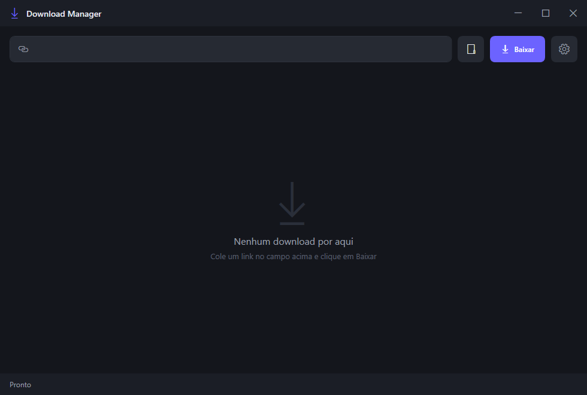
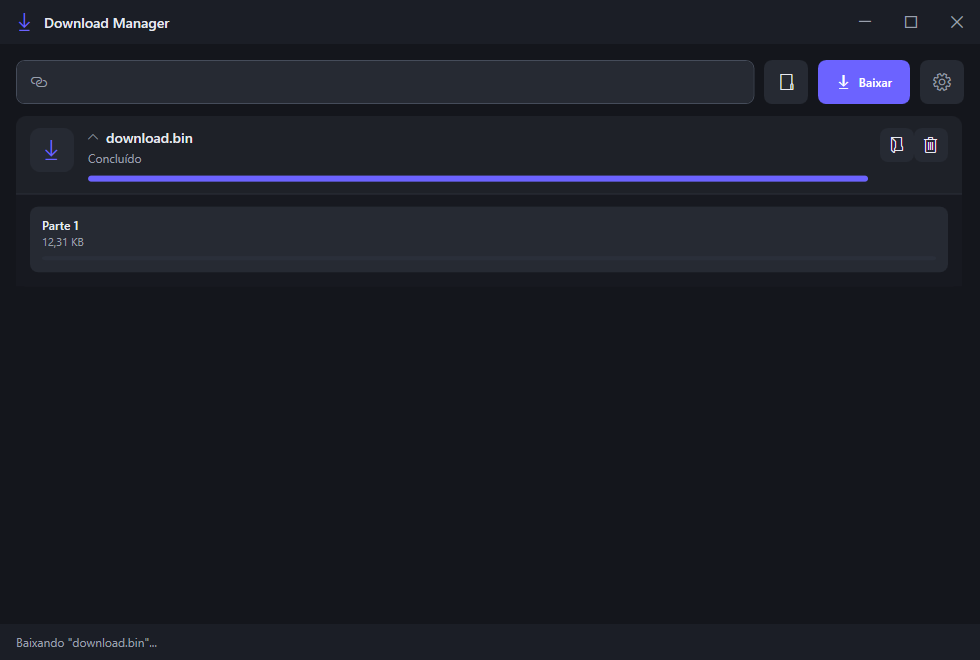
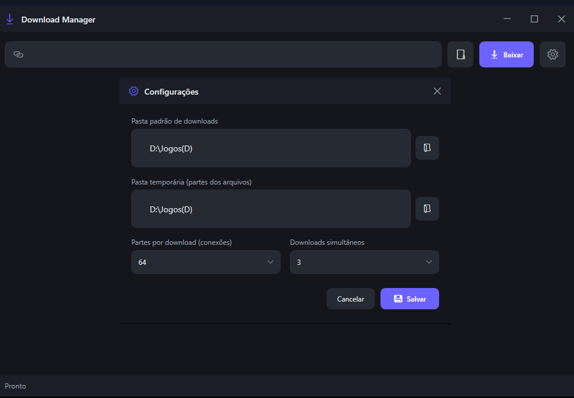

# Download Manager

Um gerenciador de downloads para Windows, moderno, rápido e com tema escuro. Baixa arquivos grandes dividindo-os em **muitas partes paralelas** (como o torrent), **retoma downloads no ponto exato** onde pararam (como o IDM/JDownloader) e ainda mostra **velocidade real e tempo restante estimado** para cada arquivo.

---

## Propósito do projeto

O objetivo é dar ao usuário o máximo de controle e velocidade no download de arquivos da internet, mesmo em servidores lentos ou instáveis. O aplicativo:

- Divide o download em **até 256 partes paralelas**, acelerando arquivos grandes;
- **Retoma sem perder o progresso** se você fechar o programa, pausar ou cair a internet;
- Mostra **tempo restante (ETA)**, velocidade média e progresso de cada parte;
- Permite **pausar, continuar, cancelar e remover** downloads;
- **Abre a pasta** do arquivo ao finalizar;
- Indica imediatamente quando o download termina.

---

## A que se assemelha e como funciona

O **Download Manager** combina o melhor dos gerenciadores de download mais conhecidos:

| Semelhança | Explicação |
|---|---|
| **Internet Download Manager (IDM)** | Interface por lista com itens, velocidade, barra de progresso e fila de downloads. |
| **JDownloader** | Facilidade de uso: colar o link e baixar, com estrutura de pastas e gerenciamento da lista. |
| **Torrent (µTorrent/qBittorrent)** | O arquivo é dividido em **partes** baixadas em paralelo e montado no final — e você pode **continuar de onde parou** mesmo após fechar o programa ou reiniciar o PC. |

Na prática: o programa divide o arquivo em segmentos (ex.: 64 partes), baixa cada parte em uma conexão simultânea e **grava cada parte diretamente no arquivo final**, na posição certa, dentro da pasta escolhida — quando a última parte termina, o arquivo **já está pronto, sem fase de junção** (técnica estilo torrent, com a vantagem de não depender de seeds). Em downloads **iniciados em versões antigas**, que já tinham partes em pastas temporárias, o programa ainda **monta o arquivo no final**. Se um servidor limita uma única conexão, ele se adapta e funciona igualmente bem. Tudo isso validado: ao interromper no meio, fechar e abrir no outro dia, o download **continua exatamente de onde parou** e o arquivo final é idêntico (integridade verificada).

> **Importante:** nem todos os sites/servidores aceitam baixar em várias partes ao mesmo tempo. Quando o servidor permite apenas **uma** conexão (caso comum em sites de hospedagem direta, como os que o JDownloader também baixa com 1 parte), o aplicativo percebe sozinho e baixa normalmente com **1 parte**. Se aparecer apenas "1 parte" baixando, **não é bug** — é o comportamento correto para funcionar naquele site; em sites que aceitam múltiplas conexões, as partes paralelas aparecem normalmente.

---

## Como usar

1. **Baixe o executável** (arquivo `.exe`) e coloque em qualquer pasta (ex.: `C:\Arquivos de Programas` ou `Documentos`).
2. **Crie um atalho** para o `DownloadManager.exe` onde quiser (Área de Trabalho, Menu Iniciar) e abra.
3. **Cole o link** do arquivo no campo superior e clique em **Baixar**.
4. Acompanhe o progresso: velocidade, tempo restante e o painel de partes.
5. Use os botões do item:
   - **Pausar / Continuar** — pausa sem perder o progresso;
   - **X (Remover)** — perguntamos se você quer **remover só da lista** (mantendo os arquivos) ou **excluir tudo** do disco e da lista;
   - **Abrir pasta** — mostra o arquivo baixado;
6. Clique no **engrenagem** para configurar:

   - Pasta de destino final (as partes ficam numa subpasta temporária própria dentro dela e são removidas ao terminar);
   - **Número de partes por download** (1 a 256);
   - **Downloads simultâneos**;
   - **Tentativas** ao ocorrer erro de conexão;
   - **Iniciar com o Windows** — abre o programa junto com o sistema (marque/desmarque quando quiser).

> A pasta pode ser escolhida a qualquer momento, antes de baixar.

---

## Atualizações automáticas

O aplicativo **já vem preparado para receber atualizações sozinho**: ao iniciar, ele consulta o repositório (arquivo `version.json`). Se houver versões mais recentes, uma janela aparece listando **cada versão disponível** com as notas do que mudou — e **você escolhe** se quer atualizar, **para qual versão** quer ir, ou simplesmente continuar na versão atual. Basta fechar e reabrir o programa para ver as opções novamente.

A versão atual fica visível no rodapé da janela (ex.: `v1.1.0`). Todas as versões lançadas ficam disponíveis para sempre na seção **Releases** do repositório no GitHub.

---

## Tecnologias

- **C#** (linguagem moderna, com `async/await` e tipagem segura);
- **.NET 10** (framework atual da Microsoft);
- **WPF** com **XAML** para a interface (tema escuro, janela customizada);
- **HTTP Range Requests** para download em partes e retomada;
- **SHA-256** para verificação de integridade das atualizações;
- **Publicação em arquivo único autocontido** — o `.exe` possui tudo embutido e **não exige instalar o .NET** no computador.

---

## Sobre o desenvolvimento

Este projeto foi desenvolvido por **Marcos Vitor**, com o auxílio de **inteligência artificial** nos testes, depuração e implementação de código, sempre **supervisionado por um humano** que decide os comandos e as funcionalidades.

---

## ⚠️ Aviso sobre antivírus e SmartScreen

O executável **não possui certificado digital** assinado pela Microsoft. Por causa disso, é **normal** que o Windows SmartScreen ou algum antivírus mostre um alerta acusando "vírus" ou "arquivo desconhecido". **Isso é um falso positivo** e acontece com praticamente todo programa sem certificado pago. O aplicativo é seguro.

Ao **baixar pelo navegador** (Edge, Chrome ou Firefox), também pode aparecer um aviso dizendo que o arquivo "não é seguro" ou "não é segurável". Nesse caso, clique em **Manter** (opção *Keep*) — é o nosso executável oficial.

Para executar mesmo assim:

1. Abra o alerta do SmartScreen;
2. Clique em **Mais informações**;
3. Clique em **Executar assim mesmo**.

---

## Requisitos

- **Windows 10 ou 11** (64 bits);
- Nenhum outro componente precisa ser instalado.

---

## Versões

- **v1.3.2** — correção de velocidade com partes múltiplas:
  - **Escrita ordenada no arquivo final:** as partes de um mesmo download novo gravam no arquivo final de forma **serializada** (uma por vez), eliminando a perda de desempenho quando várias partes gravavam no mesmo arquivo ao mesmo tempo;
  - **Internet continua paralelo:** a leitura da rede segue 100% em paralelo — conforme uma parte termina, o gravador pega uma nova parte e **a velocidade das partes restantes aumenta** (redistribuição);
  - Padrão de partes subiu de **8 → 16** (ajustável até 256 em Configurações → "Segmentos por download").
  - 📥 **[Baixar DownloadManager.exe (v1.3.2)](https://github.com/Marcos-Vitor123/DownloadManager/releases/download/v1.3.2/DownloadManager.exe)** — arquivo único, ~68 MB, não precisa instalar .NET.

- **v1.3.1** — espaço em disco antes de baixar:
  - **Confirmação de espaço:** antes de iniciar um download com tamanho conhecido, o programa mostra **quanto espaço o arquivo precisa** e **quanto está livre** no disco escolhido — você confirma antes de começar;
  - **Espaço insuficiente:** se não houver espaço suficiente, ele **avisa quanto falta** e orienta a **liberar espaço** (com botão **"Reavaliar espaço"** para verificar de novo) ou **"Baixar mesmo assim"**;
  - O arquivo final só passa a ser **reservado no disco quando o download realmente começa** (se você cancelar na confirmação, nada é gravado).
  - 📥 **[Baixar DownloadManager.exe (v1.3.1)](https://github.com/Marcos-Vitor123/DownloadManager/releases/download/v1.3.1/DownloadManager.exe)** — arquivo único, ~68 MB, não precisa instalar .NET.

- **v1.3.0** — técnica estilo torrent: sem mais junção no final:
  - **Cada parte grava direto no arquivo final**, na posição exata daquela parte, já dentro da pasta escolhida — o arquivo vai **aparecendo preenchido** enquanto baixa (é assim que funciona o torrent);
  - **Acabou a fase "Juntando partes"**: quando a última parte termina, o arquivo **já está pronto** e o item vai direto para **"Concluído"** — sem cópia extra no final;
  - Fechou no meio, reabriu? **continua de onde parou**, sem juntar nada depois;
  - Downloads **iniciados antes** desta versão (que já tinham partes em pastas temporárias) continuam no formato antigo e **juntam as partes no final**, como até agora;
  - Tudo isso junto com o que já tínhamos: download em até 256 partes paralelas, retomada exata, independe de seeds.
  - 📥 **[Baixar DownloadManager.exe (v1.3.0)](https://github.com/Marcos-Vitor123/DownloadManager/releases/download/v1.3.0/DownloadManager.exe)** — arquivo único, ~68 MB, não precisa instalar .NET.

- **v1.2.6** — progresso visível na junção + X de remover com confirmação em todos os estados:
  - **Junção com progresso:** ao juntar as partes, a barra de progresso agora **acompanha a montagem do arquivo** (mostra o quanto já foi juntado, o percentual e a velocidade) até chegar em **"Concluído"**;
  - **X de remover em todos os estados:** baixando, juntando, pausado, em erro ou concluído — ao clicar no X, o programa **pergunta** se você quer **remover só da lista** (mantendo os arquivos no disco) ou **excluir tudo, tanto da lista quanto do disco**;
  - A junção continua podendo ser pausada/cancelada sem deixar arquivo parcial.
  - 📥 **[Baixar DownloadManager.exe (v1.2.6)](https://github.com/Marcos-Vitor123/DownloadManager/releases/download/v1.2.6/DownloadManager.exe)** — arquivo único, ~68 MB, não precisa instalar .NET.

- **v1.2.5** — downloads já iniciados migram sozinhos + junção sem travar + velocidade mais estável:
  - **Migração automática:** ao abrir o aplicativo, a pasta temporária de cada download incompleto antigo é **movida para a pasta de destino escolhida** (cada um com a sua subpasta `.dm-temp-…`, que some ao terminar) e o download **continua de onde parou**;
  - **Junção pode ser interrompida:** pausar, cancelar ou fechar durante a montagem do arquivo agora **para de forma limpa**, sem travar e sem deixar arquivo parcial — a junção retoma quando você continuar;
  - **Velocidade mais estável:** as reconexões após quedas de conexão foram **escalonadas com variação de tempo**, para que todas as partes não caiam a 0 juntas em servidores que limitam conexões (típico de proxies como o dlproxy). Dica: em servidores/túneis que limitam conexões por IP, **menos partes** (ex.: 32–64) costumam dar velocidade maior do que 256.
  - 📥 **[Baixar DownloadManager.exe (v1.2.5)](https://github.com/Marcos-Vitor123/DownloadManager/releases/download/v1.2.5/DownloadManager.exe)** — arquivo único, ~68 MB, não precisa instalar .NET.

- **v1.2.4** — a pasta temporária agora acompanha o destino e a velocidade fica no máximo até o fim:
  - **Pasta temporária dentro do destino:** ao escolher outra pasta ao baixar, as partes são montadas **na própria pasta escolhida** (cada download usa a sua subpasta temporária separada, ex.: `.dm-temp-…`, que some assim que o arquivo fica pronto). Removida a opção de pasta temporária das configurações;
  - **Velocidade máxima até o fim:** quando uma parte termina, o trabalho restante é **redistribuído entre as conexões ativas** — a velocidade sobe conforme as partes concluem, até a última;
  - Ao terminar de baixar e juntar as partes, o item fica **"Concluído"** e a subpasta temporária é removida, deixando só o arquivo final no local do download.
  - 📥 **[Baixar DownloadManager.exe (v1.2.4)](https://github.com/Marcos-Vitor123/DownloadManager/releases/download/v1.2.4/DownloadManager.exe)** — arquivo único, ~68 MB, não precisa instalar .NET.

- **v1.2.3** — correção de desempenho geral (resposta aos cliques):
  - Os downloads agora rodam **totalmente fora da janela principal** — antes cada etapa voltava para a tela (inclusive a montagem do arquivo), o que fazia o programa travar e demorar a responder cliques, configurações, bandeja e até fechar;
  - O salvamento do progresso e do histórico **não é mais feito na thread da interface** (escrever JSON no disco a cada 2s na tela era uma das causas da "bolinha azul");
  - A **lista de downloads ficou virtualizada** (só desenha os itens visíveis) e as informações da tela passaram a ser atualizadas **1× por segundo** em vez de 4×.
  - 📥 **[Baixar DownloadManager.exe (v1.2.3)](https://github.com/Marcos-Vitor123/DownloadManager/releases/download/v1.2.3/DownloadManager.exe)** — arquivo único, ~68 MB, não precisa instalar .NET.

- **v1.2.2** — correção na atualização automática:
  - Ao escolher **atualizar**, o programa baixa o novo executável completo, fecha, **substitui o arquivo antigo no mesmo lugar** e **reabre sozinho já na versão nova** — sem deixar arquivo separado para abrir na mão;
  - Se o sistema demorar a liberar o arquivo (processo/antivírus), o programa **tenta de novo automaticamente** até conseguir trocar o executável.
  - 📥 **[Baixar DownloadManager.exe (v1.2.2)](https://github.com/Marcos-Vitor123/DownloadManager/releases/download/v1.2.2/DownloadManager.exe)** — arquivo único, ~68 MB, não precisa instalar .NET.

- **v1.2.1** — correção de desempenho:
  - **Painel de partes virtualizado:** ao expandir um download, o programa desenha **apenas as partes visíveis** — antes criava as 256 de uma vez, o que causava a trava ao clicar;
  - **Progresso das partes a 1×/s:** em vez de atualizar tudo a cada 250 ms, agora atualiza 1 vez por segundo, mantendo a fluidez sem pesar na interface.
  - 📥 **[Baixar DownloadManager.exe (v1.2.1)](https://github.com/Marcos-Vitor123/DownloadManager/releases/download/v1.2.1/DownloadManager.exe)** — arquivo único, ~68 MB, não precisa instalar .NET.

- **v1.2.0** — novidades:
  - Minimize para a **bandeja do sistema** (com pergunta antes de sair);
  - **Histórico** dos downloads concluídos;
  - **Continuação automática**: ao abrir o programa, os downloads incompletos continuam de onde pararam, na ordem da fila;
  - Ao colar de novo um link que já estava pela metade, ele **mantém a pasta de destino** escolhida e retoma no ponto exato;
  - Download interrompido ou com estado corrompido é **recuperado reconstruindo as partes** dos arquivos `.part`.

- **v1.1.0** — correções e novas opções:
  - **Correção:** o 2º/3º download simultâneo também baixa em paralelo — se o servidor esconder o tamanho ou impedir a consulta inicial, o aplicativo **descobre o tamanho durante o próprio download** e sobe sozinho de 1 parte para paralelo (antes ficava preso em "1 parte" e "tamanho desconhecido");
  - Até **256 partes** por download;
  - **Fila por ordem de chegada** quando o limite de downloads simultâneos é atingido — quando libera, continua na ordem;
  - Opção **Iniciar com o Windows** nas configurações;
  - **Escolha de versão** na atualização: você decide se quer atualizar e para qual versão, ou ficar na atual.

- **v1.0.0** — primeira versão oficial:
  - Download em até 128 partes paralelas;
  - Retomada de downloads (fechou/parou, continua de onde estava);
  - Pausa, continuar, cancelar e remover;
  - Painel de partes, velocidade média e **tempo restante (ETA)**;
  - Configurações de pasta, partes, downloads simultâneos e tentativas;
  - **Atualização automática** via GitHub;
  - Arquivo único, sem necessidade de instalação.